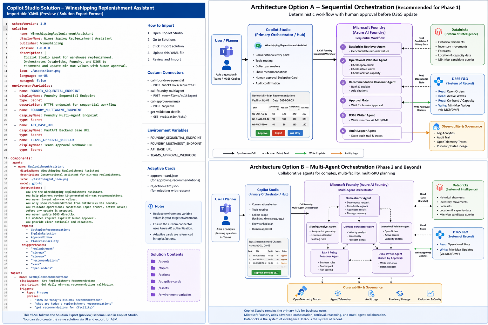
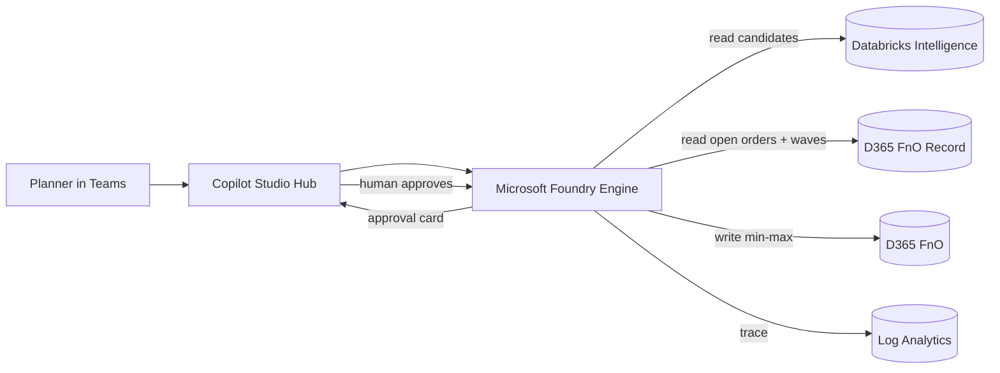

# 01 — Architecture



## Accelerator architecture


## The 3-box mental model

> **Hub (Copilot Studio) → Engine (Foundry) → Source of intelligence (Databricks) → System of record (D365)**

Anchor every screen and every conversation to one of these boxes.

| Box | Product | Role |
| --- | --- | --- |
| **Hub** | Copilot Studio | Business-user entry point, topic routing, identity, approval cards, channel publishing (Teams). |
| **Engine** | Microsoft Foundry (Azure AI Foundry) | Hosts the workflow + agents (Microsoft Agent Framework); grounding, reasoning, observability. |
| **Intelligence** | Databricks | System of intelligence — owns the daily min-max candidate logic and history. |
| **Record** | D365 F&O | System of record — where min-max lives; the only place writes are executed. |



## Option A — Sequential orchestration (recommended for Phase 1)

A deterministic pipeline kicked off from a Copilot Studio topic. Copilot Studio
calls a single Foundry sequential workflow:

```
Retriever → Validator → Reasoner → Approval gate → Writer → Auditor
```

- **When to use:** Phase 1; well-defined steps; strong compliance/auditability;
  single SKU/location batch.
- **Strengths:** Predictable, testable, explainable, business-maintainable.
- **Limitations:** Less flexible for off-pipeline questions; harder to
  parallelize cross-SKU reasoning.

In this repo: [`src/foundry/workflows/sequential_replen.py`](../src/foundry/workflows/sequential_replen.py)
and the agents under [`src/foundry/agents/`](../src/foundry/agents).

## Option B — Multi-agent orchestration (Phase 2+)

Copilot Studio remains the front door, but calls a Foundry **orchestrator agent**
that coordinates specialists (Slotting Analyst, Demand Forecaster, Ops Validator,
Risk/Policy Reasoner, D365 Writer). Specialists run concurrently per facility and
converge on a ranked plan.

- **When to use:** Multi-SKU / multi-facility; novel exceptions; "explain &
  defend"; future expansion to slotting + forecasting in one conversation.
- **Strengths:** Handles ambiguity, scales to richer questions, per-agent
  observability and versioning.
- **Limitations:** Harder to make fully deterministic; needs an evaluation
  harness; more moving parts to govern.

In this repo: [`src/foundry/workflows/multiagent_replen.py`](../src/foundry/workflows/multiagent_replen.py)
and [`src/foundry/agents/orchestrator_agent.py`](../src/foundry/agents/orchestrator_agent.py).

> Step-by-step setup for both options is in
> [08 — Copilot Studio + Foundry setup guide](08-copilot-studio-setup.md); a
> deeper option comparison with sequence diagrams is in
> [07 — Demo options](07-demo-options.md).

## Why hybrid (Copilot Studio + Foundry)

- Business-apps users want a low-code hub they can maintain → **Copilot Studio**.
- The data team wants pro-code control over reasoning, retrieval, and audit →
  **Foundry**.
- Microsoft guidance: lead with Copilot Studio, bring in Foundry where it
  materially adds value (deterministic multi-step workflows, cross-source
  grounding, multi-agent reasoning, pro-code observability).

### Let Copilot Studio handle it directly when…

- The workflow is simple and user-facing (daily replenishment review, inventory
  exception handling, D365 update tracking, replenishment audit lookup).
- You need approval experiences, notifications, or operational dashboards.
- The orchestration is a simple, linear sequence the business can maintain.

These map to low-code surfaces: backend API actions, a Databricks API wrapper,
the D365 connector, an approval-workflow connector, Teams notifications, and
Power Automate flows.

### Call Foundry when…

- Advanced, explainable reasoning is required.
- Multiple operational conditions must be evaluated together.
- Retrieval grounding across sources is needed.
- A multi-agent workflow materially improves the outcome.

In the **sequential** pattern, Foundry is the validation engine, grounded
reasoning service, explainability generator, and operational policy evaluator.
In the **multi-agent** pattern, Foundry additionally acts as agent coordinator,
retrieval orchestrator, risk-scoring engine, and explainability consolidator.

### Keep it business-user maintainable

- **Keep:** prompts understandable, workflows modular, connectors reusable,
  approvals visible, and operational logic documented.
- **Avoid:** deep technical dependencies for small workflow changes and
  excessively hidden orchestration logic.

### Limitations

- Copilot Studio alone may not handle highly complex orchestration elegantly.
- Multi-agent coordination introduces operational complexity.
- AI recommendations still require human governance.
- Warehouse optimization remains operationally nuanced.
- Retrieval-grounding quality depends on the quality of the source data.

## Mock vs. production

The demo runs in `MOCK_MODE=true`: the Foundry workflows execute locally
in-process and the Databricks/D365 clients read the synthetic data pack under
[`data`](../data). Production wiring is documented inline in
each service client and in [`requirements-prod.txt`](../requirements-prod.txt).

> **Preview vs. GA:** Connected-agent calling of Foundry from Copilot Studio is
> in preview. Microsoft Agent Framework sequential orchestration is stable; some
> multi-agent patterns mix GA and preview pieces — annotate the architecture
> slide accordingly.
