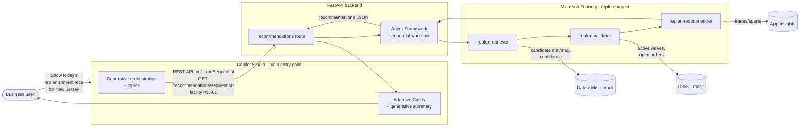

# 05 — Copilot Studio + Microsoft Foundry Integration

Copilot Studio is the **main entry point**: the low-code, business-user-owned
conversational surface in Teams or web chat. It routes prompts, surfaces approval
cards, and calls the governed **Microsoft Foundry** workflow — which orchestrates
the persistent Foundry agents (`replen-retriever`, `replen-validator`,
`replen-recommender`) over Databricks + D365 facts.

See [`copilot-studio/`](../copilot-studio) for the importable solution package.
For the click-by-click setup runbook (provision → agents → backend → Copilot
Studio), use [08 — Copilot Studio + Foundry setup guide](08-copilot-studio-setup.md).

## Architecture



---

## Worked example — "Show today's replenishment recommendations"

This is the canonical demo flow, end to end.

### 1. User opens the Copilot Studio agent (Teams or web chat) and asks:

> **"Show today's replenishment recommendations for the New Jersey facility."**

> [!NOTE]
> Business users speak in facility *names*; the agent maps them to facility
> *codes* (`New Jersey → NJ-01`, `California → CA-02`). In the demo the two
> seeded facilities are `NJ-01` and `CA-02`. Substitute your own names/codes
> (e.g. "Dallas → TX-01") by editing the topic's mapping table or the agent
> instructions.

### 2. Copilot Studio behavior

1. Receives the user request and resolves intent via **generative orchestration**.
2. Resolves the facility name to a code (`New Jersey → NJ-01`).
3. Calls the backend tool **`runSequential`** → `GET /recommendations/sequential?facility=NJ-01`.
4. The backend runs the **Foundry sequential workflow** (Retriever → Validator →
   Recommender). The Recommender narration is produced by the persistent
   `replen-recommender` Foundry agent; the min/max numbers and decisions stay
   deterministic.
5. Renders **Adaptive Cards** (one per SKU) plus a short natural-language summary.

### 3. Databricks + D365 activity (behind the workflow)

- **Databricks** (system of intelligence): returns the candidate min/max rows and
  the rationale/confidence per SKU. *Mocked in the demo.*
- **D365** (system of record): supplies live wave/order state the Validator
  checks against. *Mocked in the demo.*

### 4. Demo UI / card output

Each recommendation card shows exactly these fields (verified live from the
backend):

| Field | Example | Source |
| --- | --- | --- |
| SKU | `CHARD-750-12` | Databricks candidate |
| Location | `PM-A14` | Databricks candidate |
| Current min / max | `90 / 300` | D365 / Databricks |
| Suggested min / max | `100 / 320` | Databricks candidate |
| Confidence | `74%` | Databricks model |
| Decision | `needs_review` | Recommender (deterministic policy) |
| Active wave warning | *none* (or `WV-2026-06-05-014`) | D365 validation |
| Explanation | *"Moderate confidence (74%)… Recommend a quick human check before applying 100/320."* | `replen-recommender` agent |
| Citations | `databricks://…`, `d365://waves/NJ-01` | Workflow grounding |

Real backend payload for one card:

```jsonc
{
  "candidate": {
    "sku": "CHARD-750-12", "facility": "NJ-01", "location": "PM-A14",
    "current_min": 90, "current_max": 300,
    "recommended_min": 100, "recommended_max": 320,
    "rationale": "Slight upward drift; capacity headroom available.",
    "confidence": 0.74
  },
  "validation": { "sku": "CHARD-750-12", "passed": true,
                  "blocking_wave_id": null, "blocking_orders": [] },
  "decision": "needs_review",
  "explanation": "Moderate confidence (74%). Slight upward drift; capacity headroom available. Recommend a quick human check before applying 100/320.",
  "citations": ["databricks://candidates/NJ-01/CHARD-750-12", "d365://waves/NJ-01"]
}
```

A SKU blocked by an active wave (e.g. `CAB-750-12` / `WV-2026-06-05-014`) returns
`decision: "reject"` with the blocking wave id — the card renders a red "active
wave" warning and **no approve button**.

---

## Two integration paths

Copilot Studio can reach the Foundry workflow two ways. Both are supported; the
demo ships **Path A**.

| | **Path A — REST API tool (default in this demo)** | **Path B — Native Foundry agent tool** |
| --- | --- | --- |
| How | Copilot Studio calls the FastAPI backend (`/recommendations/sequential`, `/validate`, `/approve`) via an OpenAPI **REST API tool**. The backend runs the Agent Framework workflow over the persistent Foundry agents. | Copilot Studio delegates directly to a Foundry agent via **Tools → Add a tool → Azure AI Foundry agent**. The agent runs as a sub-agent. |
| Best for | Multi-step deterministic governance: candidate → validate → decide → human-approved write, with citations. | Single-agent reasoning where Copilot Studio owns orchestration and you want the agent as a callable skill. |
| Governance | Strong — the backend enforces decisions, the writer agent is the only path to D365, and approval is a human action. | The Foundry agent handles its own turn; writes/approvals still go through your governed endpoint. |
| Ships in demo | ✅ `copilot-studio/actions/*.json` | Documented below; not packaged. |

---

## Path A — add the REST API tool

> Copilot Studio renamed **Actions → Tools** (April 2025+). The steps below
> reflect the current UI. See
> [Extend your agent with tools from a REST API](https://learn.microsoft.com/en-us/microsoft-copilot-studio/agent-extend-action-rest-api).

### Step 1 — Add the tool

1. Open your agent → **Tools** tab → **Add a tool** → **New tool** → **REST API**.
2. Upload the OpenAPI spec
   [`copilot-studio/actions/call-foundry-sequential.json`](../copilot-studio/actions/call-foundry-sequential.json).
   Copilot Studio requires **OpenAPI v2 (Swagger) JSON** — the shipped spec is
   already v2. (A v3 spec is auto-converted on upload.)
3. Point `host` at your backend (the FastAPI service or its public front door).
4. Improve the description (orchestration uses it to pick the tool), e.g.:
   *"Returns today's governed replenishment recommendations for a facility:
   per-SKU current vs. suggested min/max, confidence, decision, active-wave
   warnings, and citations."*

### Step 2 — Configure authentication

Pick one:

| Option | When to use | Fields |
| --- | --- | --- |
| **API key** | Backend behind a function key / gateway key. Simplest for a demo. | Parameter label = `Function Key`; Parameter name = `code`; Parameter location = **Query**. |
| **OAuth 2.0** | Production. Backend protected by Entra ID (App Service Easy Auth v2). | Client ID + secret of your Entra app; Authorization URL `https://login.microsoftonline.com/<tenant>/oauth2/v2.0/authorize`; Token URL `.../oauth2/v2.0/token`; Scope `api://<APP_ID>/.default`. |

> [!IMPORTANT]
> For OAuth, grant the **Copilot Studio first-party app**
> (`38e2b35e-2ae8-48c9-9c8a-cb0a1ba27cdc`, "Power Virtual Agents") permission to
> your API, set the token audience to `api://<APP_ID>`, and restrict
> *"Which Microsoft 365 organization"* to **My organization only**.

### Step 3 — Select operations & review parameters

Enable the operations you want the agent to call:

| Operation | Backend endpoint | Purpose |
| --- | --- | --- |
| `runSequential` | `GET /recommendations/sequential` | Single-facility recommendations (the worked example). |
| `validateSku` | `GET /validate` | "Why was X rejected?" — returns validator evidence. |
| `approve` | `POST /approve` | Human-approved min/max write (writer agent → D365). |

Fill in any blank input/output descriptions (required to proceed).

### Step 4 — Tool behavior

- **Details** → check **"Allow agent to decide dynamically when to use the tool."**
- **Completion** → **"Write the response with generative AI"** so Copilot Studio
  formats the cards/summary and surfaces citations.
- **Create connection** (enter the function key for API-key auth) →
  **Add and configure**.

### Step 5 — (Optional) wire into a topic for explicit routing

If you prefer deterministic routing over generative orchestration:

1. **Topics** → create/edit a topic (e.g. `GetReplenRecommendations`).
2. **Add node (+)** → **Add a tool** → select `runSequential`.
3. Map the resolved facility code to the `facility` input.
4. Author a card/response template referencing the output variables.

The shipped topics already do this — see the table below.

---

## Path B — native Foundry agent tool (alternative)

Copilot Studio can delegate straight to a persistent Foundry agent:

1. **Tools** → **Add a tool** → **New tool** → **Azure AI Foundry agent**.
2. Select your Foundry **project** (`replen-project`) and the agent
   (e.g. `replen-recommender`).
3. The Foundry agent runs as a sub-agent for the matched turns.

See [Add a Foundry agent to Copilot Studio](https://learn.microsoft.com/en-us/microsoft-copilot-studio/add-agent-foundry-agent).

> Use Path B when you want the agent itself as a callable skill. Keep
> approval/writes flowing through the governed `/approve` endpoint so the
> human-in-the-loop control and D365 audit trail are preserved.

---

## Topics

| Topic | Purpose | Tool · operation |
| --- | --- | --- |
| `GetReplenRecommendations` | Entry topic. Slots `facility`, `date`. | `call-foundry-sequential` · `runSequential` → approval cards |
| `ExplainRejection` | "Why did you reject X?" Returns validator evidence. | `call-foundry-sequential` · `validateSku` |
| `ApproveMinMax` | Handles the approval button payload. | `call-foundry-sequential` · `approve` |
| `PlanCrossFacility` | Cross-facility planning. | `call-foundry-multiagent` · `runMultiAgent` → bulk-approve card |

## Agent system instructions (excerpt)

> *You are the Replenishment Assistant. You never invent min-max values — you only
> present and explain candidates returned by the Foundry workflow. Map facility
> names to codes before calling tools. You never write to D365 directly; only the
> Foundry writer agent does, and only after explicit human approval. Always show
> the current vs. suggested min/max, the confidence, any active-wave warning, and
> cite the Databricks candidate id and the D365 state used to validate.*

## Generative AI settings (Settings → Generative AI)

- **Use generative AI orchestration** = **Yes**.
- **Allow the AI to use its own general knowledge** = **Off** (grounded answers
  only).
- **Content moderation** = **High**.

## Connectors & channels

- **REST API tool → backend / Foundry** (OpenAPI v2 in
  [`copilot-studio/actions`](../copilot-studio/actions)). Secure with API key or
  Entra ID OAuth 2.0.
- **Adaptive Cards** — approval + rejection cards in
  [`copilot-studio/adaptive-cards`](../copilot-studio/adaptive-cards).
- **Teams channel publish** — primary channel; web chat optional.
  Publish via **Channels → Microsoft Teams → Availability options**.

## When to call Foundry vs. handle in Copilot Studio

| Handle in Copilot Studio | Call Foundry |
| --- | --- |
| Greetings, FAQ ("what's a wave?") | Multi-step deterministic workflow |
| Confirmation flows, approval routing | Cross-source grounding (Databricks + D365) |
| Simple parameter collection | Multi-agent reasoning / ranking |
| Facility name → code mapping | Policy/rule evaluation best done in pro-code |

---

## Test it

### A. Test the backend the tool calls

```bash
# Start the backend (mock data; live agent narration optional)
./start.sh                       # or: uvicorn app.main:app --app-dir src --port 8080

# The exact call runSequential makes:
curl -s "http://localhost:8080/recommendations/sequential?facility=NJ-01" | jq

# Single-SKU validation (ExplainRejection):
curl -s "http://localhost:8080/validate?facility=NJ-01&sku=CAB-750-12" | jq

# Approval write (ApproveMinMax) — writer agent → D365 (mock):
curl -s -X POST "http://localhost:8080/approve" -H "Content-Type: application/json" \
  -d '{"sku":"CHARD-750-12","facility":"NJ-01","new_min":100,"new_max":320,
       "approver_upn":"planner@contoso.com","rationale":"Approved in review"}' | jq
```

Expected: 12 recommendations for `NJ-01`; `CAB-750-12` is `reject` with
`blocking_wave_id` `WV-2026-06-05-014`; `CHARD-750-12` is `needs_review` at
0.74 confidence with `100/320` suggested.

To route narration through the **persistent Foundry agent** with tracing, start
live: set `FOUNDRY_USE_AGENTS=true`, `FOUNDRY_MODE=live`,
`AZURE_FOUNDRY_PROJECT_ENDPOINT`, and `APPLICATIONINSIGHTS_CONNECTION_STRING`
(keep `MOCK_MODE=true` so Databricks/D365 stay mocked). Spans
(`invoke_agent replen-recommender:1`, `chat gpt-4o`, `workflow.run`, …) appear in
Application Insights.

### B. Test in Copilot Studio

1. Open the **Test** pane.
2. Try:
   - "Show today's replenishment recommendations for the New Jersey facility."
   - "Why was CAB-750-12 rejected?"
   - "Approve the Chardonnay change."
3. Verify the cards show current vs. suggested min/max, confidence, the active-wave
   warning, and citations — and that rejected SKUs have **no** approve button.

---

## Troubleshooting

| Symptom | Likely cause / fix |
| --- | --- |
| Tool not invoked | Improve the tool **description**; confirm generative orchestration is **On**. |
| 401 / consent loop | OAuth audience/scope mismatch; ensure Copilot Studio app `38e2b35e-…` is authorized and scope is `api://<APP_ID>/.default`. |
| 400 "Live Foundry mode not configured" | `foundry=live` requested but `AZURE_FOUNDRY_PROJECT_ENDPOINT` unset on the server. Use mock or set the endpoint. |
| Generic answers, no citations | Turn **off** "general knowledge"; set Completion to "Write the response with generative AI". |
| Spec rejected on upload | Must be OpenAPI **v2 JSON**; the shipped spec already is. |
| Numbers look invented | They aren't — they're deterministic from Databricks; the agent only narrates. Check the `citations` array. |

## Maintainability

- Keep topic logic small; push reasoning to Foundry.
- Use plain-English instructions, not regex slot fillers.
- Version topics in the solution; export to an ALM pipeline.

## Limitations to call out honestly

- Native **Foundry agent tool** and **REST API tool** are both evolving Copilot
  Studio features (REST API tool is in preview) — review data flows and security
  before production.
- Copilot Studio's native knowledge sources hide chunking/embedding choices;
  complex retrieval should sit in Foundry / Azure AI Search.
- Long-running, deeply branching workflows are easier to author in Agent
  Framework (pro-code) than in topics — which is why this demo keeps the
  multi-step governance in the Foundry workflow and uses Copilot Studio as the
  entry point.

## References

- [Extend your agent with tools from a REST API (preview)](https://learn.microsoft.com/en-us/microsoft-copilot-studio/agent-extend-action-rest-api)
- [Add a Foundry agent to Copilot Studio](https://learn.microsoft.com/en-us/microsoft-copilot-studio/add-agent-foundry-agent)
- [Azure AI Search knowledge in Copilot Studio](https://learn.microsoft.com/en-us/microsoft-copilot-studio/knowledge-azure-ai-search)
