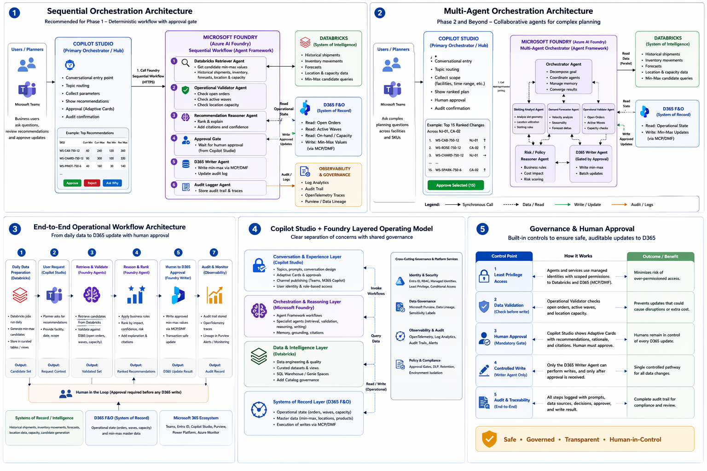
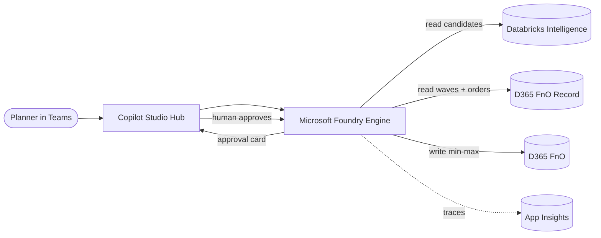
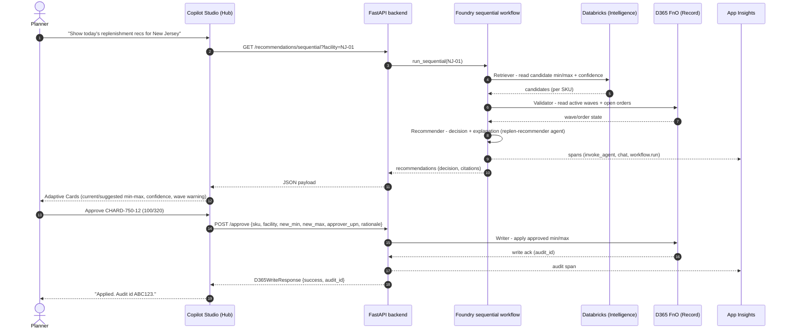
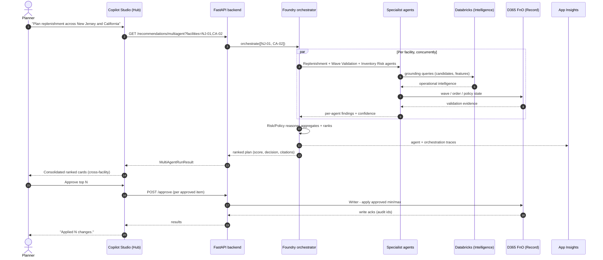
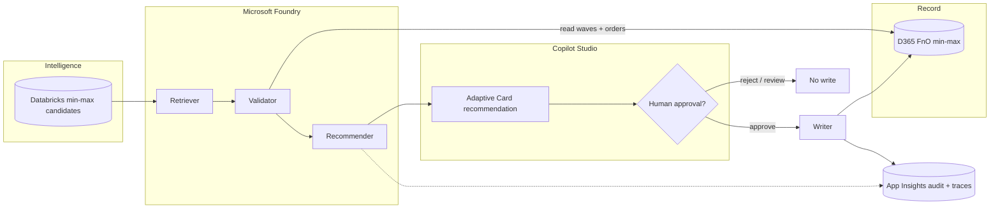
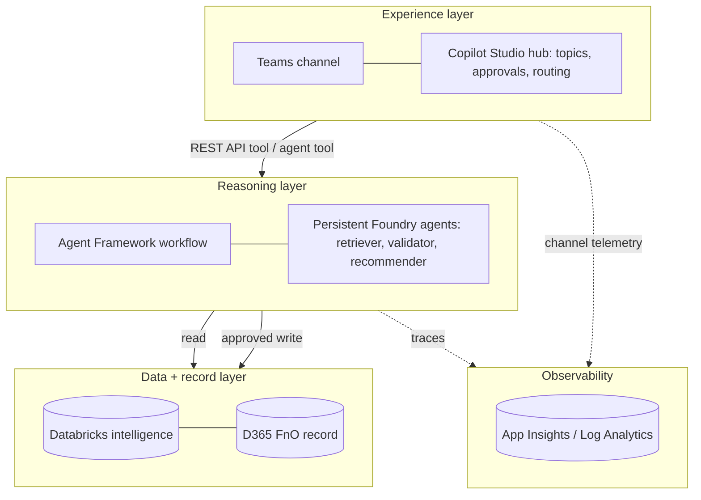
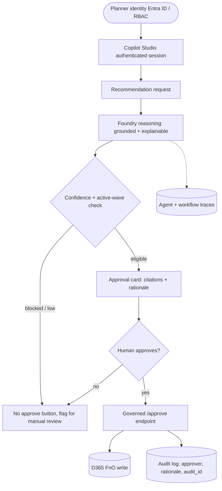
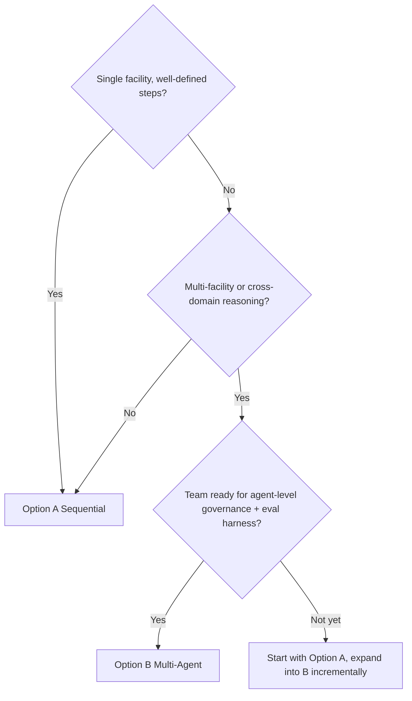

# 07 — Demo Options: Sequential vs. Multi-Agent Orchestration

Two ways to run the replenishment demo. Both keep **Copilot Studio as the
operational hub** and **D365 as the only place writes land**. They differ in how
much reasoning Foundry coordinates behind the hub.



> Patterns 1 and 2 above are Options A and B below; pattern 3 is the
> [end-to-end workflow](#pattern-3--end-to-end-operational-workflow), pattern 4
> the [layered operating model](#pattern-4--layered-operating-model), and
> pattern 5 the [governance controls](#pattern-5--governance--human-approval) —
> each with its own diagram below. (The diagram shows illustrative `WS-` SKU
> prefixes; the running demo uses neutral SKUs like `CAB-750-12`.)

| | **Option A — Sequential** | **Option B — Multi-Agent** |
| --- | --- | --- |
| Orchestrator | Copilot Studio + one Foundry workflow | Foundry orchestrator coordinating specialists |
| Best for | Pilots, single-facility, explainability | Multi-facility networks, cross-domain intelligence |
| Backend endpoint | `GET /recommendations/sequential` | `GET /recommendations/multiagent` |
| In this repo | [`src/foundry/workflows/sequential_replen.py`](../src/foundry/workflows/sequential_replen.py) | [`src/foundry/workflows/multiagent_replen.py`](../src/foundry/workflows/multiagent_replen.py) + [`orchestrator_agent.py`](../src/foundry/agents/orchestrator_agent.py) |
| Maturity | Recommended starting point | Phase 2+ expansion |

> **Positioning:** *Start practical. Grow into advanced orchestration over time.*
> Begin with Sequential, expand into Multi-Agent incrementally, and preserve
> Copilot Studio as the operational hub throughout.

The 4-box model both options share:



---

## Option A — Sequential Orchestration (recommended starting point)

### Architecture overview

Copilot Studio is the primary orchestrator. It triggers a single, deterministic
Foundry workflow that runs a fixed pipeline:

```
Retriever → Validator → Recommender → Approval gate → Writer → Auditor
```

1. Copilot Studio triggers the workflow.
2. Databricks recommendation service returns min-max suggestions.
3. Foundry validation workflow evaluates operational conditions (active waves,
   open orders).
4. Human approval occurs in Copilot Studio.
5. D365 update API executes approved changes.
6. Audit logging persists workflow activity (App Insights + audit id).

### Sequence



### When to use

Initial pilots · low operational complexity · explainable workflows · faster
implementation timelines · business-led operational improvements · controlled
rollout.

### Where each product sits

- **Copilot Studio** — primary user-interaction layer, workflow trigger,
  approval interface, operational dashboard/chat. Handles prompts, approval
  workflows, notifications, D365 workflow initiation, simple orchestration.
- **Foundry** — retrieval grounding, validation reasoning, recommendation
  scoring, explainable analysis. Called only for complex reasoning, advanced
  validation, risk scoring, operational conflict detection.
- **Databricks** — central data platform and recommendation source (historical
  shipments, inventory movement, open waves, forecast demand, location
  utilization, inventory health trends). *Mocked in the demo.*
- **D365** — updated only after recommendation → AI validation → human approval,
  via the secure FastAPI API layer (Power Platform connector / middleware in
  production). *Mocked in the demo.*

### Human-in-the-loop checkpoints

Human review required before: high-impact changes, bulk updates, updates during
active wave activity, large threshold modifications. UI actions: **Approve
Recommendation**, **Flag for Manual Review**, **Reject Recommendation**.

### Governance / security

RBAC via Microsoft identity stack · human-approval enforcement · API-level
authorization · audit logging · recommendation explainability · prompt/activity
monitoring (App Insights) · operational threshold enforcement · environment
isolation for production vs. demo.

### Strengths & limitations

| Strengths | Limitations |
| --- | --- |
| Easier to explain | Limited autonomous optimization |
| Faster to implement | Less adaptive orchestration |
| Lower operational risk | Simpler reasoning patterns |
| Business-user friendly | Limited parallel decision-making |
| Strong governance, realistic adoption path | |

### Try it

```bash
curl -s "http://localhost:8080/recommendations/sequential?facility=NJ-01" | jq
```

---

## Option B — Multi-Agent Orchestration (Phase 2+)

### Architecture overview

Copilot Studio remains the hub, but calls a Foundry **orchestrator** that
coordinates specialized agents. Specialists analyze operational context
independently (and concurrently per facility); results are aggregated into a
consolidated, ranked plan surfaced for human approval.

Flow: Copilot Studio receives request → Foundry orchestrator coordinates
specialists → agents analyze independently → results aggregated → consolidated
recommendations surfaced → human approval → D365 updates execute.

### Sequence



### Example specialist agents

Replenishment Recommendation Agent · Active Wave Validation Agent · Inventory
Risk Agent · D365 Policy Validation Agent · Forecast Intelligence Agent ·
Explainability Agent.

> In this repo the orchestrator
> ([`orchestrator_agent.py`](../src/foundry/agents/orchestrator_agent.py)) runs a
> Slotting Analyst (reusing the sequential path), a Demand Forecaster, and a
> Risk/Policy reasoner concurrently per facility, then ranks. In production these
> map to Microsoft Agent Framework handoff + concurrent orchestration hosted in
> Foundry, each a persistent agent with its own identity, version, and traces.

### When to use

Larger warehouse networks · multi-facility optimization · advanced operational
complexity · cross-domain operational intelligence · long-term AI operational
maturity.

### Where each product sits

- **Copilot Studio** — remains the primary business-user interface, workflow
  launch point, approvals UI, operational command center, and notification
  layer. It does **not** take on deep multi-agent orchestration.
- **Foundry** — coordinates multi-agent orchestration, retrieval pipelines,
  reasoning chains, validation workflows, explainable responses, cross-source
  evaluation.
- **Databricks** — shared operational memory layer: grounding queries,
  structured recommendation source, feature engineering, historical intelligence.
- **D365** — updates remain controlled: agents produce a recommendation package →
  Copilot Studio surfaces results → human approval captured → approved payload
  posted to the D365 integration API.

### Human-in-the-loop checkpoints

Approvals required before batch updates, during inventory volatility, during
operational conflict conditions, and for low-confidence recommendations. Foundry
produces confidence scores, audit traceability, supporting evidence, and
grounding references.

### Governance / security (additions over Option A)

Agent-level authorization · agent trace logging · retrieval-grounding validation
· prompt governance · decision explainability · human-override controls · tool
invocation controls.

### Strengths & limitations

| Strengths | Limitations |
| --- | --- |
| Flexible architecture | More complex design |
| Advanced operational intelligence | Harder to explain |
| Better scalability | More operational governance needed |
| Enables complex validations | Longer rollout timeline |
| Supports future automation evolution | Higher implementation-maturity requirement |
| Enables cross-domain orchestration | |

### Try it

```bash
curl -s "http://localhost:8080/recommendations/multiagent?facilities=NJ-01,CA-02" | jq
```

---

## Pattern 3 — End-to-end operational workflow

The same demo, viewed as the day-in-the-life flow that spans intelligence,
reasoning, approval, write, and audit. This is what either option produces from
the planner's point of view.



**Stages:** read candidates (Databricks) → validate against operational state
(D365 waves/orders) → score + explain (Foundry recommender) → surface card
(Copilot Studio) → human approve → write min/max (D365) → persist audit id +
traces (App Insights). Rejected or low-confidence SKUs stop before any write.

---

## Pattern 4 — Layered operating model

How the two products divide responsibility. Copilot Studio owns the experience
and orchestration; Foundry owns the reasoning; the data planes stay read-mostly
with writes gated by approval.



**Reading it:** the experience layer never touches the record directly; every
write travels down through the reasoning layer's governed path. Each layer emits
telemetry to the observability layer so a run is traceable end to end.

---

## Pattern 5 — Governance & human approval

The control plane that wraps both options: identity, the approval gate, the
single write path, and the audit trail.



**Controls:** RBAC-authenticated entry · grounded, explainable reasoning ·
eligibility gate (confidence + active waves) · mandatory human approval before
any write · single governed write path to D365 · immutable audit (approver UPN,
rationale, `audit_id`) · full agent/workflow tracing. See
[04 — Governance](04-governance.md) for the detailed control list.

---

## Decision guide



| Question | Lean A | Lean B |
| --- | --- | --- |
| Operational complexity | Low–medium | High |
| Facilities in scope | One at a time | Network / multi-facility |
| Explainability priority | Maximum | High but more nuanced |
| Governance maturity | Standard RBAC + approval | + agent-level controls |
| Timeline | Fast | Longer |

## Recommended customer positioning

- **Start** with Sequential Orchestration.
- **Expand** into multi-agent orchestration incrementally.
- **Preserve** Copilot Studio as the operational hub throughout.
- Narrative: *"Start practical. Grow into advanced orchestration over time."*

## Related docs

- [01 — Architecture](01-architecture.md) — the 4-box model and hybrid rationale.
- [04 — Governance](04-governance.md) — RBAC, approval, audit, monitoring.
- [05 — Copilot Studio + Foundry integration](05-copilot-studio.md) — entry point,
  REST API tool, worked example.
- [06 — Foundry](06-foundry.md) — persistent agents, workflow, tracing.
