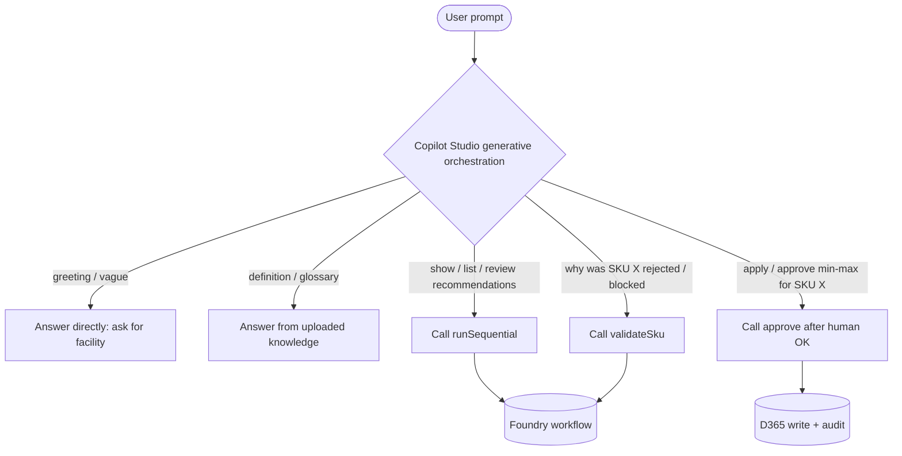

# 08 — Copilot Studio + Foundry Setup Guide (step by step)

This is the end-to-end runbook for standing up the demo: provision Azure +
Foundry, provision the persistent agents, run the backend, then create the
Copilot Studio agent and connect it to Foundry. Copilot Studio is the **main
entry point / hub**; Foundry runs the reasoning; Databricks/D365 are the data
planes (mocked in the demo).

> Companion docs: [01 — Architecture](01-architecture.md),
> [05 — Copilot Studio integration patterns](05-copilot-studio.md),
> [07 — Demo options](07-demo-options.md), [06 — Foundry](06-foundry.md).

## Architecture


The five patterns this demo implements (sequential, multi-agent, end-to-end
workflow, layered operating model, governance):


> [!NOTE]
> The diagram images currently show illustrative `WS-` SKU prefixes; the running
> demo uses neutral SKUs (e.g. `CAB-750-12`). Regenerate the images if you need
> them to match exactly.

## Two integration paths

| Path | What it is | Best for |
| --- | --- | --- |
| **Path A — REST API tool → backend (default)** | Copilot Studio calls the FastAPI backend (`/recommendations/sequential`, `/validate`, `/approve`) via an OpenAPI REST API tool. The backend runs the Agent Framework workflow over the persistent Foundry agents. | Governed multi-step workflow, grounded citations, human-approved D365 writes. |
| **Path B — Native Foundry agent tool** | Copilot Studio delegates directly to a persistent Foundry agent via *Tools → Add a tool → Azure AI Foundry agent*. | Single-agent reasoning as a callable skill. |

## Prerequisites

| Requirement | Notes |
| --- | --- |
| Copilot Studio license | Power Virtual Agents / Copilot Studio. |
| Power Platform environment | Your tenant environment. |
| Azure subscription | To run `azd provision` (Foundry account, project, `gpt-4o`, App Insights). |
| Azure CLI + azd | `az login` completed. |
| Python 3.13 + venv | `source .venv/bin/activate`. |
| Foundry project endpoint | `AZURE_FOUNDRY_PROJECT_ENDPOINT` (from azd outputs). |
| App Insights connection string | `APPLICATIONINSIGHTS_CONNECTION_STRING` (for tracing). |
| Backend reachable by Copilot Studio | Public HTTPS endpoint (App Service / Container App / tunnel) in production. |

---

## Part 1 — Provision Azure, Foundry agents, and the backend

### Step 1: Provision Azure infrastructure

Provisions the Foundry account + project, the `gpt-4o` deployment, Key Vault,
Log Analytics, the user-assigned identity, and Application Insights (wired to the
project as an `AppInsights` connection).

```bash
cd ~/warehouse-replenishment-ai-demo
azd provision --no-prompt
```

Key outputs to capture (also written to `.azure/<env>/.env`):

- `AZURE_FOUNDRY_PROJECT_ENDPOINT`
- `APPLICATIONINSIGHTS_CONNECTION_STRING`
- `FOUNDRY_USE_AGENTS=true`

### Step 2: Provision the persistent Foundry agents

Creates the three **New-Foundry prompt agents** (`replen-retriever`,
`replen-validator`, `replen-recommender`) in your project, each as a managed
agent with its own version.

```bash
source .venv/bin/activate
source <(grep AZURE_FOUNDRY_PROJECT_ENDPOINT .azure/*/.env)
python scripts/provision_foundry_agents.py
```

Expected: `role → agent_name` for retriever/validator/recommender, each at
version 1. Verify in the Foundry portal that they appear under **Agents** (kind
*prompt*, model `gpt-4o`).

### Step 3: Run the backend

```bash
# Mock data (Databricks/D365), live agent narration + tracing through Foundry:
MOCK_MODE=true FOUNDRY_USE_AGENTS=true FOUNDRY_MODE=live ./start.sh
# or fully local/mock narration:
#   MOCK_MODE=true FOUNDRY_MODE=mock ./start.sh
```

Smoke test the exact endpoint Copilot Studio will call:

```bash
curl -s "http://localhost:8080/recommendations/sequential?facility=NJ-01" | jq '.count'
curl -s http://localhost:8080/health | jq
```

`/health` should report `"foundry_use_agents": true` and
`"tracing_enabled": true` when configured live. Stop with `./stop.sh`.

> In production, deploy the backend behind HTTPS (App Service / Container Apps)
> and protect it with a function key or Entra ID so Copilot Studio can reach it.

---

## Part 2 — Create the Copilot Studio agent

### Step 1: Create the agent

1. Go to [Copilot Studio](https://copilotstudio.microsoft.com/).
2. Click **Create → New agent**.
3. Name: `Replenishment Assistant`.
4. Description: `Shows governed min-max replenishment recommendations and routes approvals to D365.`
5. Language: English.

### Step 2: Configure agent instructions

On the **Overview** page, set the **Instructions**:

```
You are the Replenishment Assistant. You never invent min-max values — you only
present and explain recommendations returned by the Foundry workflow.

- Map facility names to codes before calling tools (New Jersey -> NJ-01,
  California -> CA-02).
- For each SKU, show: current vs. suggested min/max, the confidence, any active
  wave warning, and the decision (approve_suggested / needs_review / reject).
- Cite the Databricks candidate id and the D365 state used to validate.
- You never write to D365 directly. Only the Foundry writer path does, and only
  after explicit human approval.
- For rejected SKUs (blocked by an active wave) do not offer an approve button.
- Use professional, concise language.
```

> For the **full routing instructions** that make Copilot Studio decide *when*
> to call Foundry vs. answer directly, use the expanded version in
> [Orchestration pattern](#orchestration-pattern--copilot-studio-decides-when-to-call-foundry)
> below.

### Step 3: Configure generative AI settings

1. Go to **Settings → Generative AI**.
2. Confirm **Use generative AI orchestration** is **Yes**.
3. Turn **off** *Allow the AI to use its own general knowledge* (grounded-only).
4. Set **Content moderation** to **High**.
5. Click **Save**.

---

## Orchestration pattern — Copilot Studio decides when to call Foundry

This is the heart of the hybrid model: **Copilot Studio is the orchestrator**.
Its generative orchestration reads the user's intent and decides, per turn,
whether to answer directly, call a Foundry tool, or combine both. You steer that
decision with two levers: **agent instructions** (global routing rules) and
**tool descriptions** (per-tool "use this when… do NOT use this for…" guidance).

### Four response paths

| Path | Handled by | Example prompt |
| --- | --- | --- |
| **Copilot only** | Copilot Studio | "Hi" / "I need to review replenishment" → greet + ask for the facility |
| **Copilot knowledge** | Copilot Studio + uploaded glossary | "What does `needs_review` mean?" / "What's a wave?" |
| **Foundry only** | A Foundry tool | "Show today's recommendations for New Jersey" → `runSequential` |
| **Hybrid (both)** | Copilot + Foundry | "Review NJ-01 and explain the riskiest SKU" → `runSequential` + `validateSku` |



### Lever 1 — routing instructions (paste into agent Instructions)

This expands Part 2 Step 2 with explicit "handle directly" vs. "call Foundry"
rules so orchestration routes correctly:

```
You are the Replenishment Assistant. Copilot Studio orchestrates; Foundry reasons.
You never invent min-max values — you only present and explain recommendations
returned by the Foundry tools.

GATHER CONTEXT FIRST:
If the user is vague ("help me with replenishment", "check inventory"), DO NOT
call a tool. Ask which facility (e.g., New Jersey / NJ-01, California / CA-02)
and, if relevant, which SKU.

WHEN TO HANDLE DIRECTLY (NO FOUNDRY CALL):
- Greetings and intake: "Hi", "I need help" -> greet and ask for the facility.
- Definitions / glossary: "What's a wave?", "What does needs_review mean?" ->
  answer from uploaded knowledge.
- Facility name -> code mapping: resolve New Jersey -> NJ-01 yourself.

WHEN TO CALL runSequential (Foundry):
- The user wants to SEE / SHOW / LIST / REVIEW today's recommendations or
  min/max suggestions for a facility.

WHEN TO CALL validateSku (Foundry):
- The user asks WHY one specific SKU was rejected or flagged, or whether it is
  blocked by an active wave or open orders.

WHEN TO CALL approve (Foundry -> D365):
- ONLY after a human explicitly approves a specific new min and max for a named
  SKU and facility. Never approve autonomously.

HYBRID:
- For "review X and explain the riskiest SKU", call runSequential, then call
  validateSku for the flagged SKU, and combine the results.

RESPONSE STYLE:
- Show current vs. suggested min/max, confidence, any active-wave warning, and
  the decision. Cite the Databricks candidate id and D365 state.
- For rejected SKUs, do not offer an approve button.
- Be professional and concise; ask clarifying questions for vague requests.
```

### Lever 2 — tool descriptions (the strongest routing signal)

Orchestration weighs each tool's **description** heavily when choosing whether to
call it. Write each as "use this tool when… do NOT use this for…". These ship in
[`copilot-studio/actions/call-foundry-sequential.json`](../copilot-studio/actions/call-foundry-sequential.json)
as the operations' `description` fields:

| Operation | Description (routing signal) |
| --- | --- |
| `runSequential` | *"Run today's full replenishment review for a facility. Use this tool when the user asks to SEE, SHOW, LIST, or REVIEW replenishment recommendations… Do NOT use this for a single specific SKU status question (use validateSku) or to apply a change (use approve)."* |
| `validateSku` | *"Explain the operational status of ONE specific SKU… Use this tool when the user asks WHY a SKU was rejected or flagged… Do NOT use this to list all recommendations (use runSequential) or to apply a change (use approve)."* |
| `approve` | *"Apply an approved min/max change to D365 for a specific SKU. Use this tool ONLY after a human has explicitly approved… NEVER call it without explicit human approval — approval is a human action."* |

> When you add the REST API tool (Part 3), keep these descriptions — they are what
> let orchestration pick the right operation. If a tool is being over- or
> under-called, tighten its description first.

### Question routing summary

| User intent | Routed to | Source |
| --- | --- | --- |
| Greeting / intake | Copilot Studio | None |
| "What's a wave / needs_review?" | Copilot Studio | Uploaded glossary |
| "Show recommendations for NJ-01" | Foundry | `runSequential` |
| "Why was CAB-750-12 rejected?" | Foundry | `validateSku` |
| "Approve CHARD-750-12 at 100/320" | Foundry → D365 | `approve` (after human OK) |
| "Review NJ-01 and explain the riskiest SKU" | Both | `runSequential` + `validateSku` |

### Verify routing (test these in the Test pane)

| # | Prompt | Expected routing |
| --- | --- | --- |
| 1 | "Hi, I need to review replenishment" | Copilot only — asks for the facility, **no** Foundry call. |
| 2 | "What does needs_review mean?" | Copilot knowledge — answers from glossary, **no** Foundry call. |
| 3 | "Show today's recommendations for New Jersey" | Foundry — calls `runSequential` (NJ-01). |
| 4 | "Why was CAB-750-12 rejected?" | Foundry — calls `validateSku`, returns blocking wave `WV-2026-06-05-014`. |
| 5 | "Approve the Chardonnay change at 100/320" | Foundry → D365 — calls `approve` only after you confirm. |
| 6 | "Review NJ-01 and explain the riskiest SKU" | Hybrid — `runSequential` then `validateSku`. |

---

## Part 3 — Path A: Foundry via REST API tool (default)

> Copilot Studio renamed **Actions → Tools** (April 2025+). The steps below
> reflect the current UI. Complete Part 2 (instructions + generative AI settings)
> first.

### Step 1: Add the REST API tool

1. Open your agent → **Tools** tab.
2. Click **Add a tool → New tool → REST API**.
3. Upload the OpenAPI spec
   [`copilot-studio/actions/call-foundry-sequential.json`](../copilot-studio/actions/call-foundry-sequential.json)
   (OpenAPI **v2/Swagger JSON**; v3 is auto-converted).
4. Set `host` to your backend's public HTTPS endpoint.
5. Verify the operations (`runSequential`, `validateSku`, `approve`) are detected
   → **Next**.
6. Improve the **Description**:
   `Returns today's governed replenishment recommendations for a facility: per-SKU current vs. suggested min/max, confidence, decision, active-wave warnings, and citations.`
7. Select a **Solution** (or leave blank to auto-create) → **Next**.

### Step 2: Configure authentication

**Option A — API key** (simplest; backend behind a function/gateway key):

| Field | Value |
| --- | --- |
| Parameter label | `Function Key` |
| Parameter name | `code` |
| Parameter location | **Query** |

**Option B — OAuth 2.0** (production; backend behind Entra ID / Easy Auth v2):

| Field | Value |
| --- | --- |
| Client ID / secret | Your Entra app registration |
| Authorization URL | `https://login.microsoftonline.com/<tenant>/oauth2/v2.0/authorize` |
| Token URL | `https://login.microsoftonline.com/<tenant>/oauth2/v2.0/token` |
| Scope | `api://<APP_ID>/.default` |

> [!IMPORTANT]
> For OAuth, authorize the Copilot Studio first-party app
> `38e2b35e-2ae8-48c9-9c8a-cb0a1ba27cdc` ("Power Virtual Agents") on your API,
> set the token audience to `api://<APP_ID>`, and restrict to **My organization
> only**.

Click **Next**.

### Step 3: Select and configure the operations

1. Select the operations to expose:

   | Operation | Endpoint | Purpose |
   | --- | --- | --- |
   | `runSequential` | `GET /recommendations/sequential` | Today's recommendations for a facility. |
   | `validateSku` | `GET /validate` | "Why was X rejected?" — validator evidence. |
   | `approve` | `POST /approve` | Human-approved min/max write → D365. |

2. Review input/output parameters. For `runSequential`: input `facility`
   (string); outputs include `recommendations[]` with `candidate`
   (sku, current/recommended min/max, confidence), `validation`
   (`blocking_wave_id`), `decision`, `explanation`, `citations`.
3. Fill in any blank parameter descriptions → **Next**.

### Step 4: Review and publish

1. Review the tool configuration → **Next**.
2. Wait for the tool to publish.
3. Click **Create connection** → enter your Azure function key (API-key auth) or
   complete the OAuth consent.
4. Select **Add and configure** to attach the tool to your agent.

### Step 5: Configure tool behavior

1. Under **Details** → check **Allow agent to decide dynamically when to use the
   tool**.
2. Under **Completion** → select **Write the response with generative AI** (so
   Copilot Studio formats the cards/summary and surfaces citations).
3. Click **Save**.

### Step 6: Wire the tool into topics (optional)

For explicit routing instead of (or alongside) generative orchestration:

1. Go to **Topics** → create/edit a topic (e.g. `GetReplenRecommendations`).
2. **Add node (+) → Add a tool →** select `runSequential`.
3. Map the resolved facility code to the `facility` input.
4. Under **Completion**, author a card/response template referencing the output
   variables (SKU, current/suggested min-max, confidence, wave warning).

The shipped topics already do this — see
[`copilot-studio/`](../copilot-studio) and the topic→endpoint table in
[05 — Copilot Studio](05-copilot-studio.md#topics--backend-mapping).

---

## Part 3 (alternative) — Path B: add the Foundry agent directly

Copilot Studio can delegate straight to a persistent Foundry agent:

1. Go to **Tools → Add a tool → New tool →** select **Azure AI Foundry agent**.
2. Select your Foundry project (`replen-project`) and the agent
   (e.g. `replen-recommender`).
3. The Foundry agent runs as a sub-agent for matched turns.

See [Add a Foundry agent to Copilot Studio](https://learn.microsoft.com/en-us/microsoft-copilot-studio/add-agent-foundry-agent).

> Keep approvals/writes flowing through the governed `/approve` endpoint so the
> human-in-the-loop control and D365 audit trail are preserved.

---

## Publish to Teams

1. Go to **Channels → Microsoft Teams**.
2. Click **Turn on Teams**.
3. Configure display name `Replenishment Assistant` and a description.
4. Click **Publish**.
5. Share the bot link with planners. (Web chat is optional.)

---

## Testing

### Test the backend the tool calls

```bash
# runSequential
curl -s "http://localhost:8080/recommendations/sequential?facility=NJ-01" | jq

# validateSku (ExplainRejection)
curl -s "http://localhost:8080/validate?facility=NJ-01&sku=CAB-750-12" | jq

# approve (ApproveMinMax) — writer path → D365 (mock)
curl -s -X POST "http://localhost:8080/approve" -H "Content-Type: application/json" \
  -d '{"sku":"CHARD-750-12","facility":"NJ-01","new_min":100,"new_max":320,
       "approver_upn":"planner@contoso.com","rationale":"Approved in review"}' | jq
```

Expected: 12 recommendations for `NJ-01`; `CAB-750-12` is `reject` with
`blocking_wave_id` `WV-2026-06-05-014`; `CHARD-750-12` is `needs_review` at 0.74
confidence with `100/320` suggested.

### Test in Copilot Studio

1. Open the **Test** pane and try:
   - "Show today's replenishment recommendations for the New Jersey facility."
   - "Why was CAB-750-12 rejected?"
   - "Approve the Chardonnay change."
2. Verify the cards show current vs. suggested min/max, confidence, the
   active-wave warning, and citations — and that rejected SKUs have **no** approve
   button.

### Verify tracing

In Application Insights (Logs / Transaction search), confirm spans such as
`invoke_agent replen-recommender:1`, `chat gpt-4o`, and `workflow.run` after a
live run. `az monitor app-insights query --app <app-id>` is a fast way to check
ingestion.

---

## Troubleshooting

| Symptom | Likely cause / fix |
| --- | --- |
| Tool not invoked | Improve the tool **description**; confirm generative orchestration is **On**. |
| 401 / consent loop | OAuth audience/scope mismatch; ensure Copilot Studio app `38e2b35e-…` is authorized and scope is `api://<APP_ID>/.default`. |
| 400 "Live Foundry mode not configured" | `foundry=live` requested but `AZURE_FOUNDRY_PROJECT_ENDPOINT` unset on the server. Set it or use mock. |
| Agents missing in portal | Re-run `scripts/provision_foundry_agents.py`; confirm the endpoint points at `replen-project`. |
| "Assistants are not yet supported" | Legacy Assistants API was used. This demo uses `azure-ai-projects` prompt agents — re-provision. |
| Generic answers, no citations | Turn **off** general knowledge; set Completion to "Write the response with generative AI". |
| Spec rejected on upload | Must be OpenAPI **v2 JSON**; the shipped spec already is. |
| No traces in App Insights | Set `APPLICATIONINSIGHTS_CONNECTION_STRING`; `force_flush` returning False is a harmless quirk. |

## References

- [Extend your agent with tools from a REST API (preview)](https://learn.microsoft.com/en-us/microsoft-copilot-studio/agent-extend-action-rest-api)
- [Add a Foundry agent to Copilot Studio](https://learn.microsoft.com/en-us/microsoft-copilot-studio/add-agent-foundry-agent)
- [Azure AI Search knowledge in Copilot Studio](https://learn.microsoft.com/en-us/microsoft-copilot-studio/knowledge-azure-ai-search)
