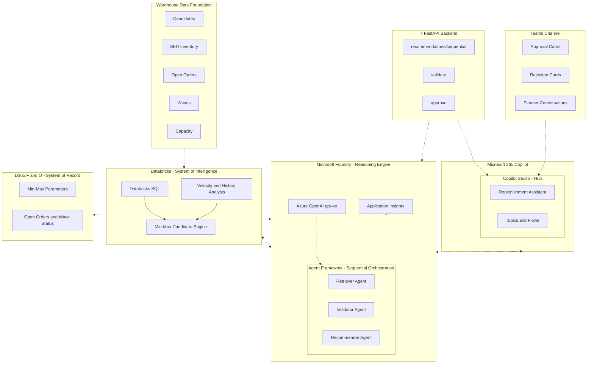

# Warehouse Replenishment AI — Architecture

This diagram represents the end-to-end warehouse replenishment architecture spanning Databricks (system of intelligence), Microsoft 365 Copilot (hub), and Microsoft Foundry (reasoning engine), with D365 F&O as the system of record.

## Architecture Diagram (Mermaid)

## Component Summary

| Platform | Components | Role |
|----------|-----------|------|
| **Databricks** | Min-Max Candidate Engine, Velocity & History Analysis, Databricks SQL | System of intelligence — daily min-max candidate logic and demand analysis |
| **Warehouse Data** | Candidates, SKU Inventory, Open Orders, Waves, Capacity | Operational data foundation for replenishment decisions |
| **Microsoft 365 Copilot** | Copilot Studio (Replenishment Assistant), Topics & Flows | Business-user entry point, orchestration hub, Teams publishing |
| **Teams** | Approval Cards, Rejection Cards, Planner Conversations | Human-in-the-loop approval and notification channel |
| **FastAPI Backend** | /recommendations/sequential, /validate, /approve | REST API bridge between Copilot Studio and Foundry workflows |
| **Microsoft Foundry** | Agent Framework (Retriever → Validator → Recommender), Azure OpenAI (gpt-4o), Application Insights | AI reasoning engine, agent orchestration, observability |
| **D365 F&O** | Min-Max Parameters, Open Orders & Wave Status | System of record — the only place writes are executed |

## Data Flow

1. **Warehouse data** (candidates, SKU inventory, orders, waves, capacity) feeds into **Databricks** for min-max candidate analysis
2. **Databricks** computes daily candidates with velocity, confidence scores, and rationale
3. **Copilot Studio** acts as the hub — the Replenishment Assistant routes user intent to the right tool
4. **FastAPI Backend** exposes `/recommendations/sequential`, `/validate`, and `/approve` as REST tools for Copilot Studio
5. **Microsoft Foundry's Agent Framework** runs the sequential pipeline: Retriever → Validator → Recommender, powered by **Azure OpenAI (gpt-4o)**
6. The **Validator Agent** cross-references D365 open orders and wave status to flag blocked SKUs
7. **Approval cards** surface in Teams; only explicit human approval triggers the **D365 write** path
8. **Application Insights** traces every agent invocation for auditability
